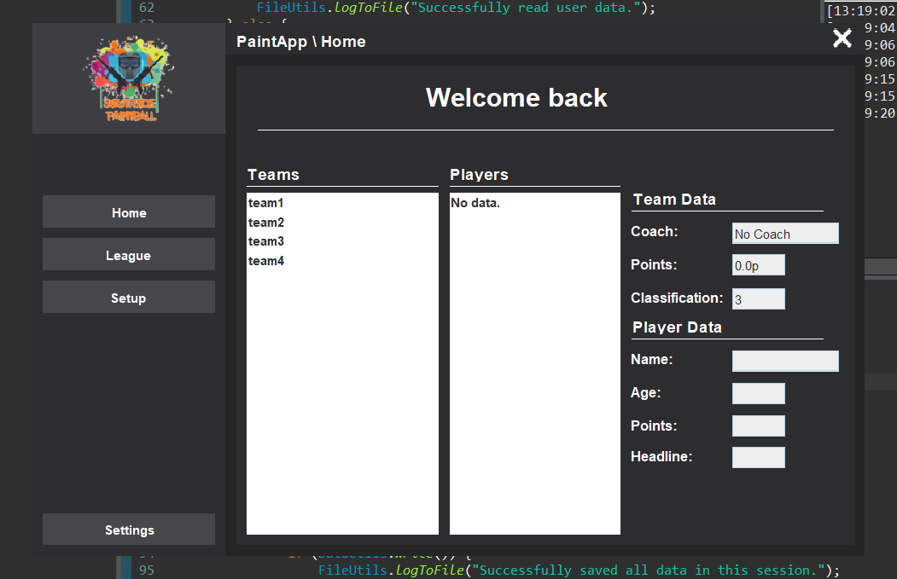

# 🌳 Paint app

<div align="center">

    

</div>

## 🌊 Description
* Simple java app for a project we had to do in class.

## ❄ Documentation
 Click [**here**](https://itsxnoobx.github.io/paint-app/) to access developer documentations

<br>



## 🔺 Features

```diff
+ Features 
	• File Saving - We had to save all the data in files. 
	• Auth/Session - Save last login credentials.
```
**ToDo**

- [ ] Automatic translations
- [ ] Database connection 
- [ ] Proper auth system
- [ ] Automatic build system on push

## 🪁 Simple Use

***Eclipse***

> Use eclipse to build the project.
